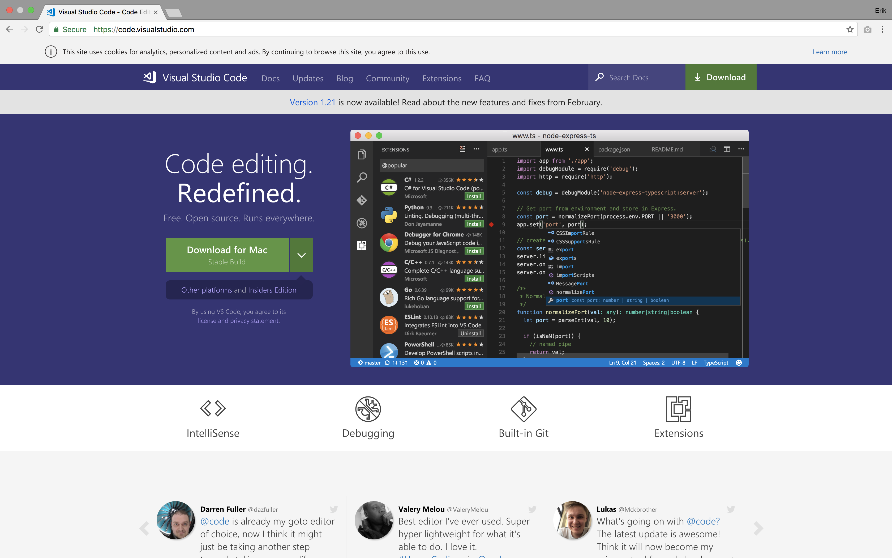

# Visual Studio Code
Visual Studio Code es un editor de texto extensible el cual es mantenido por Microsoft.

## Instalación
Puedes obtener una versión estable de Visual Studio Code en 
[este](https://code.visualstudio.com/) enlace. 



Existen dos versiones de VSCode, la versión `estable` y la versión `insiders`. La 
diferencia de esta última es que esta recibe las últimas actualizaciones antes de 
ser pasadas a la versión estable, además de eso, no hay diferencias significativas.

Una vez descargado, arrastra el archivo a tu carpeta de aplicaciones y estás listo para
comenzar.

## Post-Instalación

### Herramientas de línea de comando
VSCode puede instalar en tu intérprete de comandos una herramienta CLI para que puedas
acceder a ciertas funciones. Esto puede serte de utilidad en escenarios como los que
siguen:

* Necesitas utilizar las herramientas de depuración pero necesitas que VSCode mantenga
en su intérprete local ciertas variables de entorno.
* Necesitas cambiar la versión de herramientas internas.
* Necesitas instalar una gran cantidad de plugins.
* Deseas lanzar VSCode desde la terminal para abrir un archivo o una carpeta.

Para instalar las herramientas de CLI, presiona `⌘+shift+p` y elige la opción 
`Install 'code' command in PATH`.


### Plugins recomendados

Ya que tienes instalado el comando `code` en tu intérprete de comandos, puedes instalar
directamente los siguientes plugins.

* **vscode-docker:** Integra la sintaxis de las herramientas de Docker en VSCode
* **vscode-mjml:** Soporte para MJML, vistas previas y syntaxis.
* **solargraph:** Soporte para `Ruby Solargraph`, provee completitud de código y 
documentación inline basada en Yard.
* **gitlens:** Mejora aún mas las capacidades de manejo de GIT en VSCode con 
características como inline blame, historiales y diff temporal.
* **tslint:** TSLint para VSCode.
* **Ruby:** Soporte para depuración y sintaxis para Ruby.

Puedes instalarlos utilizando los siguientes comandos:
```zsh
code --install-extension PeterJausovec.vscode-docker 
code --install-extension attilabuti.vscode-mjml 
code --install-extension castwide.solargraph
code --install-extension digitalstreamio.mjml-syntax
code --install-extension eamodio.gitlens
code --install-extension eg2.tslint
code --install-extension jamiewoodio.cisco
code --install-extension ms-vscode.csharp
code --install-extension rebornix.Ruby
```

### Problemas comunes
#### No tengo intellisense
Intellisense es una característica propia de Microsoft y como tal, solo ofrece soporte
en los lenguajes desarrollados por ellos. Afortunadamente TypeScript posee un soporte
casi nativo en este editor de texto, pero Ruby carece de este. Solargraph permite
tener cierto nivel de completitud de código pero aún así no es perfecto. Si
realmente necesitas un IDE que te asista en todo aspecto, considera el uso de RubyMine.